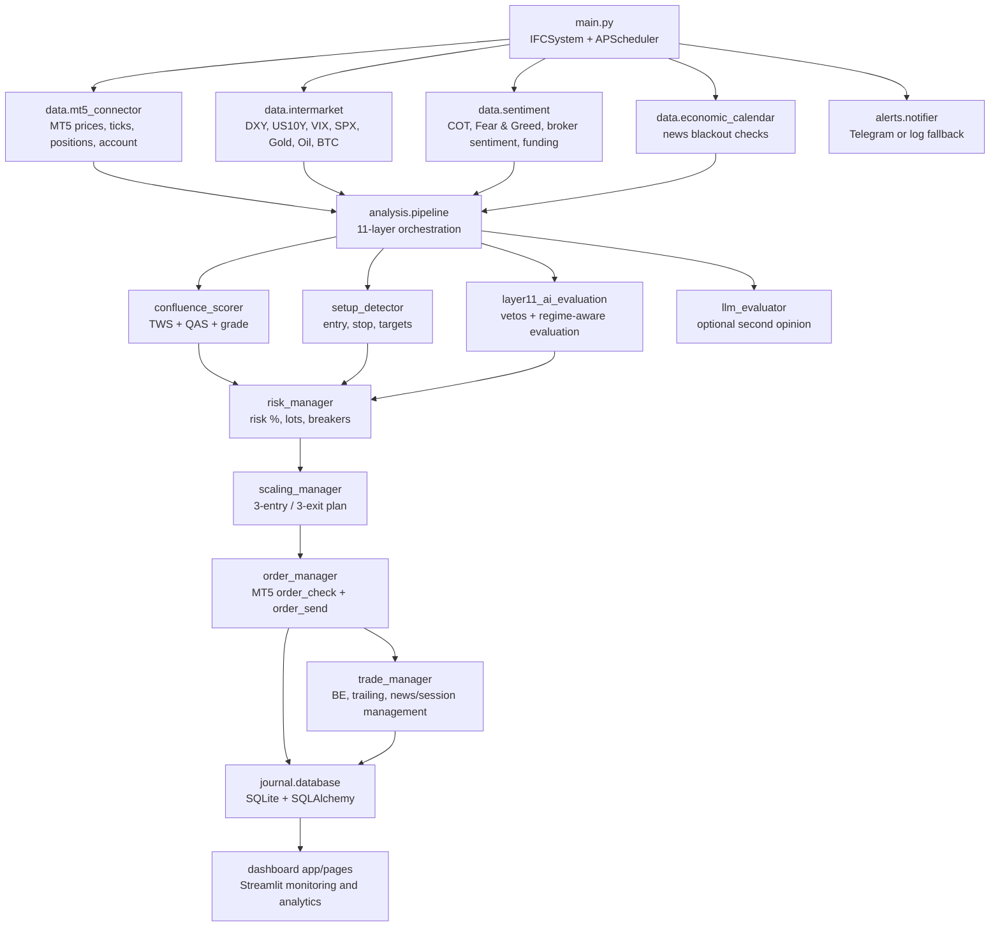
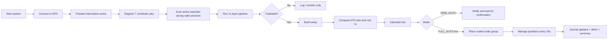
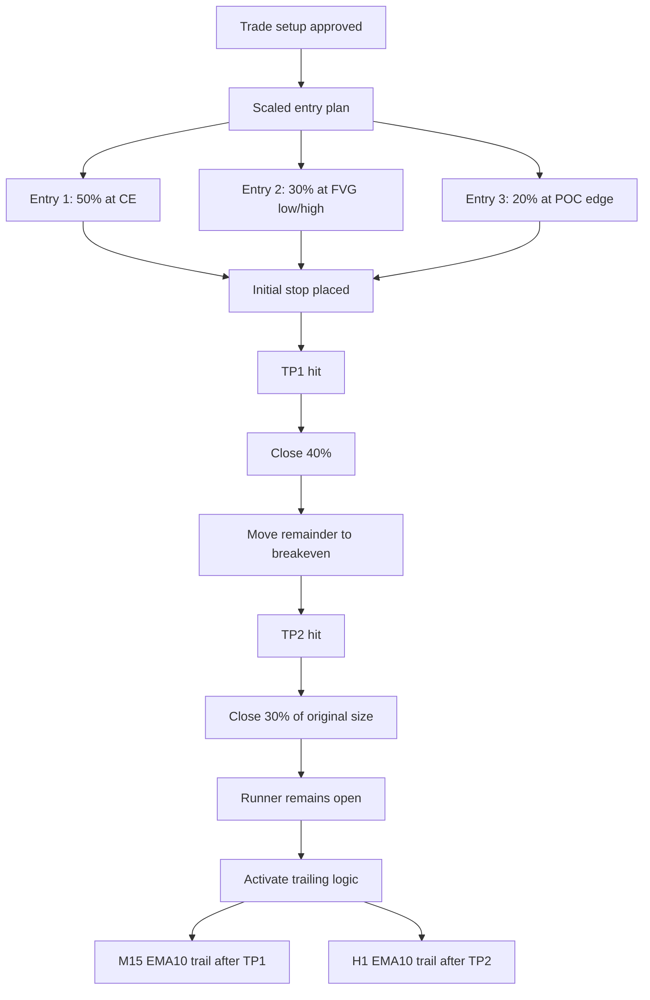

# IFC Trading System

> 11-layer institutional flow confluence trading system for MetaTrader 5 with intermarket context, volume profile, liquidity, order flow, sentiment, regime-aware scoring, scaled execution, Streamlit dashboard, journal analytics, and optional LLM second opinions.

[](.)
[](.)
[](.)
[](.)
[](.)
[](.)
[](LICENSE)

---

## Table of Contents

- [Overview](#overview)
- [What The System Does](#what-the-system-does)
- [Quick Stats](#quick-stats)
- [Architecture](#architecture)
- [Trading Loop](#trading-loop)
- [The 11 Layers](#the-11-layers)
- [Scoring Model](#scoring-model)
- [Execution Engine](#execution-engine)
- [Risk Engine](#risk-engine)
- [Supported Instruments](#supported-instruments)
- [Data Sources](#data-sources)
- [Dashboard](#dashboard)
- [Journal And Analytics](#journal-and-analytics)
- [Installation](#installation)
- [Configuration](#configuration)
- [Usage](#usage)
- [Scheduled Jobs](#scheduled-jobs)
- [Project Structure](#project-structure)
- [Implementation Notes](#implementation-notes)
- [Example Outputs](#example-outputs)
- [Contributing](#contributing)
- [License](#license)
- [Disclaimer](#disclaimer)

---

## Overview

`IFC` stands for **Institutional Flow Confluence**.

The codebase combines:

- **macro context** from intermarket data such as DXY, VIX, yields, SPX, gold, oil, and BTC
- **technical structure** from EMA stacks, BOS, and CHoCH across higher timeframes
- **auction-market logic** from volume profile, naked POCs, and POC migration
- **execution precision** from liquidity sweeps, FVGs, order blocks, and order-flow proxies
- **risk sizing** that adapts to setup quality, volatility, streaks, time/session, intermarket alignment, and drawdown state
- **automation** through APScheduler, MT5 execution, journaling, and Telegram alerts
- **optional LLM review** via Ollama, OpenAI, or Gemini for a second opinion on setups

The intended workflow is:

1. scan active instruments during valid sessions
2. run the full 11-layer pipeline
3. grade the setup with weighted confluence
4. detect a trade structure with entry, stop, and targets
5. size the trade dynamically
6. execute or queue the order plan
7. manage partials, breakeven, and trailing stops
8. log everything to the journal and surface it in the dashboard

---

## What The System Does

| Capability | Implementation |
|---|---|
| Multi-asset watchlist | 25 instruments across forex, indices, crypto, commodities, and US stocks |
| Multi-timeframe analysis | W1, D1, H4, H1, M15, and M1 depending on the layer |
| Confluence pipeline | 11 layers with configurable weights and regime-adaptive multipliers |
| Setup grading | `A+`, `A`, `B`, `NO_TRADE` from weighted TWS/QAS scoring |
| Trade setup generation | Entry, SL, TP1, TP2, TP3, RR, and confluence detail payload |
| Dynamic risk sizing | Risk adjusts for quality, volatility, streaks, time/day, intermarket, and drawdown state |
| Scaled execution | 3-entry plan and 3-stage exit logic |
| Position management | Breakeven logic, EMA trailing, news handling, and session-end rules |
| Journal | SQLAlchemy-backed SQLite journal with trade, stats, reviews, and account snapshots |
| UI | Streamlit dashboard with 16 page modules, 5 core routed pages in the main app |
| Notifications | Telegram/log fallback notifications for setups, opens, closes, TP hits, and summaries |
| LLM review | Optional backend-driven second opinion with structured prompts and caching |

---

## Quick Stats

| Metric | Value |
|---|---|
| Total files | 68 |
| Python files | 63 |
| Total lines | 15,752 |
| Python lines | 14,496 |
| Analysis layers | 11 |
| Watchlist instruments | 25 |
| Scheduler jobs | 7 |
| Streamlit page modules | 16 |
| Primary routed pages | 5 |
| Entry scaling plan | 50% / 30% / 20% |
| Exit scaling plan | 40% / 30% / 30% |
| Default trading mode | `SEMI_AUTO` |
| Default LLM backend | `ollama` |

---

## Architecture

### Figure 1: End-to-End System Map



### Figure 2: Repository Modules

```text
main.py
  |
  +-- config/
  |     +-- settings.py            core strategy, risk, time, LLM, and layer constants
  |     +-- instruments.py         25 instrument definitions and metadata
  |
  +-- data/
  |     +-- mt5_connector.py       MT5 wrapper and market/account access
  |     +-- intermarket.py         cached macro snapshot engine
  |     +-- sentiment.py           sentiment and positioning fetchers
  |     +-- economic_calendar.py   blackout windows from scraped calendars
  |
  +-- analysis/
  |     +-- pipeline.py            11-layer orchestrator
  |     +-- layer1..layer11        directional and confidence signals
  |     +-- confluence_scorer.py   TWS/QAS grading
  |     +-- regime_detector.py     trend/range/volatile classification
  |     +-- setup_detector.py      trade setup generation
  |     +-- llm_evaluator.py       optional LLM second-opinion engine
  |
  +-- execution/
  |     +-- risk_manager.py        dynamic risk + circuit breakers
  |     +-- order_manager.py       MT5 orders and modifications
  |     +-- scaling.py             3-entry / 3-exit scaling logic
  |     +-- trade_manager.py       post-entry management rules
  |     +-- smart_orders.py        recommendation cards / non-executing plans
  |
  +-- journal/
  |     +-- models.py              ORM schema
  |     +-- database.py            CRUD layer
  |     +-- analytics.py           performance breakdowns
  |
  +-- dashboard/
  |     +-- app.py                 main Streamlit router
  |     +-- components/            charts and widgets
  |     +-- pages/                 16 page modules
  |
  +-- alerts/
  |     +-- notifier.py            Telegram/log alerts
  |
  +-- utils/
        +-- helpers.py             EST/UTC, killzone, logging, decorators
```

---

## Trading Loop

### Figure 3: Runtime Lifecycle



### Runtime Modes

| Mode | Behavior |
|---|---|
| `live` + `SEMI_AUTO` | system scans and notifies, but intended final trade confirmation stays manual |
| `live` + `FULL_AUTO` | system attempts MT5 execution automatically when tradeable setups pass gates |
| `demo` | dry-run mode for signal generation, journaling, and monitoring without live execution |

---

## The 11 Layers

### Layer Table

| Layer | Weight | Module | What It Actually Does |
|---|---:|---|---|
| L1 Intermarket | 12% | `layer1_intermarket.py` | Scores macro alignment using configured correlations vs DXY, US10Y, VIX, SPX and category-specific regime bonuses |
| L2 Trend | 16% | `layer2_trend.py` | EMA10/EMA21/SMA50/SMA200 stack, swing structure, BOS/CHoCH, and weighted W1/D1/H4 direction |
| L3 Volume Profile | 12% | `layer3_volume_profile.py` | Builds M1-derived profile bins, computes POC/VAH/VAL/HVN/LVN, naked POCs, POC migration, and shape |
| L4 Candle Density | 6% | `layer4_candle_density.py` | Detects dense and thin zones from overlapping candle bodies and cross-checks them against HVN/LVN context |
| L5 Liquidity | 10% | `layer5_liquidity.py` | Finds swing highs/lows, EQH/EQL, trendline liquidity, PDH/PDL, and confirmed liquidity sweeps |
| L6 FVG + OB | 14% | `layer6_fvg_ob.py` | Detects fair value gaps, order blocks, breaker blocks, time-decayed zone relevance, and refined entries |
| L7 Order Flow | 10% | `layer7_order_flow.py` | Uses tick-volume proxy delta, cumulative delta, divergence, absorption, and optional DOM/futures confirmation |
| L8 Killzone | 8% | `layer8_killzone.py` | Applies EST session scoring, day-of-week effects, lunch rules, Friday cutoff logic, and news blackout penalties |
| L9 Correlation | 5% | `layer9_correlation.py` | Blends static and rolling correlations, computes correlation health, lead-lag, and portfolio correlation penalties |
| L10 Sentiment | 4% | `layer10_sentiment.py` | Combines Fear & Greed, VIX sentiment, broker sentiment, COT, and crypto funding into a directional composite |
| L11 AI / Regime | 3% | `layer11_ai_evaluation.py` | Provides regime-aware weighting, TWS/QAS calculation helpers, hard/soft vetos, and final decision support |

### Figure 4: Layer Flow

```text
L1 Intermarket      -> macro alignment and risk-on/risk-off context
L2 Trend            -> direction anchor from structure + moving averages
L3 Volume Profile   -> acceptance, imbalance, migration, key levels
L4 Candle Density   -> density/thin-zone support around VP structure
L5 Liquidity        -> sweeps, EQH/EQL, PDH/PDL, trendline pools
L6 FVG/Order Block  -> execution zone precision and refined entries
L7 Order Flow       -> delta, absorption, divergence confirmation
L8 Killzone         -> session timing and time/news penalties
L9 Correlation      -> cross-asset health and portfolio exposure control
L10 Sentiment       -> positioning and crowd/extreme context
L11 AI/Regime       -> adaptive weighting, vetos, final evaluation logic
```

### Notable Layer Details

| Layer | Notable Formula / Rule |
|---|---|
| L1 | `score = 5 + raw * 5`, where `raw` comes from correlation alignment plus regime bonus |
| L2 | weekly/daily/H4 weights = `40% / 35% / 25%`; conflicting higher-timeframe directions halve the final score |
| L3 | `VALUE_AREA_PCT = 0.70`, `VP_NUM_BINS = 200`; also tracks naked POCs and migration |
| L5 | EQH/EQL tolerance = `ATR * 0.1`; sweep requires wick beyond pool and close back inside with confirmation |
| L6 | FVG min size = `ATR * 0.3`; order-block impulse min = `ATR * 1.5`; time-decay half-life = `50` bars |
| L7 | divergence threshold = `0.3`; absorption looks for high volume near key level with narrow range behavior |
| L8 | news blackout penalty = `-4.0`; lunch break on forex/equity subtracts `5.0`; Friday cutoff blocks some setups |
| L9 | portfolio correlation penalties step down size to `0.40 / 0.60 / 0.80 / 0.90 / 1.00` |
| L10 | score maps roughly as `5 + (composite / 3) * 5` |
| L11 | requires directional dominance of roughly `1.2x` to break LONG/SHORT ties |

---

## Scoring Model

The system uses a weighted confluence framework rather than a single yes/no rule.

### Core Terms

| Term | Meaning |
|---|---|
| `TWS` | Total weighted score across normalized layer outputs |
| `QAS` | Quality-adjusted score: weighted score multiplied by average confidence |
| `Grade` | `A+`, `A`, `B`, or `NO_TRADE` |
| `Risk Multiplier` | Position-size multiplier derived from grade and veto state |

### Formula Summary

```text
normalized_layer_score = (raw_score - 5) / 2.5
TWS = sum(normalized_layer_score * adjusted_layer_weight)
QAS = TWS * (avg_confidence_5 / 5)
```

### Grade Thresholds

| Grade | Threshold |
|---|---:|
| `A+` | `QAS > 0.60` |
| `A` | `QAS >= 0.25` |
| `B` | `QAS >= 0.08` |
| `NO_TRADE` | below `0.08` |

### Trade Gate Thresholds

| Rule | Value |
|---|---:|
| Layer pass threshold | `5.5` |
| Minimum grade to trade | `B` |
| Minimum RR ratio | `3.0` |
| Hard-veto layers | `L2_Trend` |
| Max portfolio risk | `5.0%` |
| Max daily losses | `2` |

### Regime-Adaptive Weights

| Regime | Weight Changes |
|---|---|
| `STRONG_TREND` | boosts L2 by `1.4x` |
| `VOLATILE` | boosts L8 by `1.5x`, L7 by `1.3x`, cuts L2 to `0.7x` |
| `RANGE` | boosts L5 by `1.4x`, L6 by `1.3x`, L3 by `1.2x`, cuts L2 to `0.6x` |
| `TRANSITIONAL` | boosts L1 by `1.3x` and L11 by `1.5x` |

---

## Execution Engine

### Figure 5: Entry / Exit Plan



### Entry Logic

| Component | Rule |
|---|---|
| Entry 1 | `50%` at the CE-style anchor level |
| Entry 2 | `30%` at the FVG boundary / lower fill zone |
| Entry 3 | `20%` at the POC edge / deeper refinement |
| Order type | pending limit orders via MT5 |
| Initial TP | all legs initially target `TP1` |

### Exit Logic

| Event | Rule |
|---|---|
| TP1 | close `40%`, move the remainder to breakeven, update target to TP2 |
| TP2 | close `30%` of original size, remove fixed TP from the runner, activate trailing |
| TP3 / runner | no fixed TP; managed by trailing and context rules |

### Smart Orders Module

The repo also includes a separate non-executing recommendation engine in `execution/smart_orders.py` that builds structured trade cards with:

- three entries and weighted average entry
- stop-loss reason and stop distance
- TP1/TP2/TP3 and RR ratios
- size multiplier
- confluence levels and veto warnings
- layer score breakdown

---

## Risk Engine

### Base Settings

| Setting | Value |
|---|---:|
| Base risk | `1.5%` |
| Min risk | `0.25%` |
| Max risk | `3.0%` |
| Daily max risk | `5.0%` |
| Max trades per day | `3` |
| Breakeven trigger | `1.5R` |

### Dynamic Risk Formula

```text
final_risk_pct = base_risk
               * setup_quality_multiplier
               * volatility_multiplier
               * streak_multiplier
               * time_multiplier
               * intermarket_multiplier
```

### Multipliers

| Group | Values |
|---|---|
| Setup quality | `A+ 1.5`, `A 1.0`, `B 0.5`, `NO 0.0` |
| Volatility | `quiet 1.2`, `normal 1.0`, `high 0.6`, `extreme 0.3` |
| Streak | `win_3plus 0.8`, `normal 1.0`, `loss_2 0.7`, `loss_3plus 0.5`, `loss_5 0.0` |
| Intermarket | `all_aligned 1.2`, `mostly_aligned 1.0`, `mixed 0.6`, `contradicting 0.0` |

### Circuit Breakers

| Trigger | Action |
|---|---|
| 5 consecutive losses | hard stop |
| Daily risk used >= 5% | stop trading |
| Daily trades >= 3 | stop trading |
| Monthly DD >= 5% | half size |
| Monthly DD >= 10% | pause live |
| Monthly DD >= 15% | full stop |

### Position Sizing

```text
risk_amount = balance * risk_pct / 100
pip_cost = stop_distance_pips * pip_value_per_lot
raw_lots = risk_amount / pip_cost
lots = floor_to_broker_step(raw_lots)
```

---

## Supported Instruments

### Watchlist Breakdown

| Category | Instruments |
|---|---|
| Forex | `EURUSDm`, `GBPUSDm`, `USDJPYm`, `AUDUSDm`, `USDCADm`, `NZDUSDm`, `USDCHFm` |
| Indices | `US30m`, `USTECm`, `US500m` |
| Crypto | `BTCUSDm`, `ETHUSDm` |
| Commodities | `XAUUSDm`, `XAGUSDm`, `USOILm` |
| Stocks | `AAPLm`, `TSLAm`, `NVDAm`, `AMZNm`, `MSFTm`, `METAm`, `GOOGLm`, `NFLXm`, `AMDm`, `JPMm` |

### Instrument Metadata Stored Per Symbol

| Field | Description |
|---|---|
| `mt5_symbol` | exact broker-side MT5 symbol |
| `display_name` | human-readable label |
| `category` | forex / index / crypto / commodity / stock |
| `pip_size` | pip value in price units |
| `pip_value_per_lot` | dollar value of one pip at 1.0 lot |
| `typical_spread` | baseline spread assumption |
| `atr_reference` | expected daily ATR reference in pips |
| `yfinance_ticker` | supplementary market ticker |
| `intermarket_correlations` | configured correlation map for L1/L9 |
| `killzone_preference` | category-specific session behavior |
| `cot_name` | COT label when applicable |

### Example Symbol Metadata

| Symbol | Category | Pip Size | Typical Spread | ATR Reference |
|---|---|---:|---:|---:|
| `EURUSDm` | forex | `0.0001` | `1.0` | `60` |
| `USDJPYm` | forex | `0.01` | `1.0` | `80` |
| `USTECm` | index | `0.1` | `1.5` | `250` |
| `XAUUSDm` | commodity | `0.01` | `20` | `30` |
| `BTCUSDm` | crypto | `1.0` | `30` | `2500` |

---

## Data Sources

| Source | Module | What It Provides |
|---|---|---|
| MetaTrader 5 | `data/mt5_connector.py` | OHLCV, current tick, market depth, open positions, account info, symbol info, deal history |
| yfinance | `data/intermarket.py` | DXY, US10Y, VIX, SPX, gold, oil, BTC intermarket snapshot |
| Myfxbook / ForexFactory | `data/economic_calendar.py` | high-impact events and blackout windows |
| Myfxbook / sentiment APIs / proxies | `data/sentiment.py` | COT, Fear & Greed, retail sentiment, crypto funding proxy data |

### Intermarket Cache

| Item | Value |
|---|---:|
| Snapshot cache TTL | `300s` |
| Intermarket refresh job | every `15 min` |
| VIX regime bands | `<15 calm`, `<25 normal`, `<35 fear`, else `extreme_fear` |

### News Handling

| Rule | Value |
|---|---:|
| News blackout window | `±15 min` |
| Lunch no-trade window | `12:00-13:30 EST` |
| Friday cutoff | `12:00 EST` |

---

## Dashboard

### Primary Note

The codebase currently uses **Streamlit**, not Dash.

Run it with:

```bash
streamlit run dashboard/app.py
```

### Routed Pages In `dashboard/app.py`

| Sidebar Route | Backing Module |
|---|---|
| Pro Monitor | `dashboard/pages/pro_monitor.py` |
| Full Monitor | `dashboard/pages/full_monitor.py` |
| LLM Evaluator | `dashboard/pages/llm_dashboard.py` |
| Journal | `dashboard/pages/trade_journal.py` |
| Settings | `dashboard/pages/settings_page.py` |

### Additional Page Modules In Repo

The repository contains 16 page modules total, including exploratory or specialized pages beyond the 5 routed ones:

| Module | Page Title |
|---|---|
| `ai_evaluator.py` | AI Evaluation Engine (Layer 11) |
| `analysis_page.py` | Live Analysis |
| `auto_monitor.py` | Auto Monitor |
| `command_center.py` | Command Center |
| `correlation_dashboard.py` | Correlation Dashboard |
| `full_monitor.py` | Full Pair Monitor |
| `layer_evaluator.py` | IFC 11-Layer Evaluator |
| `live_monitor.py` | Live Monitor |
| `llm_dashboard.py` | LLM Second Opinion |
| `multi_tf_scanner.py` | Multi-TF Scanner |
| `performance.py` | Performance Analytics |
| `pro_monitor.py` | IFC Pro Monitor |
| `sentiment_dashboard.py` | Sentiment Dashboard |
| `settings_page.py` | Settings |
| `trade_journal.py` | Trade Journal |
| `trade_recommendations.py` | Smart Trade Recommendations |

### Main Dashboard Views

| Page | What You See |
|---|---|
| Pro Monitor | trade signals, all instruments, scalping tab, execution tab, positions, sentiment/intermarket |
| Full Monitor | full watchlist tables, trend heatmaps, key levels, top recommendations |
| LLM Evaluator | backend/model selection and system vs LLM comparison |
| Journal | trade table, filters, details, notes editing |
| Settings | read-only runtime configuration display |

---

## Journal And Analytics

### Database Tables

| Table | Purpose |
|---|---|
| `trades` | individual trade lifecycle records with confluence, regime, risk, MFE/MAE, TP hit flags, and MT5 refs |
| `daily_stats` | daily win rate, PnL, R, drawdown, and setup counts |
| `weekly_reviews` | weekly expectancy, profit factor, and review notes |
| `account_snapshots` | account balance/equity/margin snapshots over time |

### Trades Table Highlights

| Group | Stored Fields |
|---|---|
| Entry / Exit | entry time, entry price, entry volume, exit time, exit price, exit volume |
| Stops / Targets | initial SL, TP1, TP2, TP3 |
| Risk | risk %, risk amount, lots, stop distance pips |
| Outcome | PnL, pips, R multiple, holding time |
| Trade quality | confluence score, layers passed, layer score JSON |
| Context | market regime, killzone, setup type, grade |
| Management | TP1 hit, TP2 hit, partial volumes, MFE, MAE |
| Audit | notes, tags, screenshot path, MT5 tickets, magic number |

### Analytics Outputs

`journal/analytics.py` computes:

- win rate
- average win / average loss in R
- expectancy in R
- profit factor
- streaks
- equity curve
- max drawdown in dollars and R
- MFE / MAE averages
- hold time averages
- breakdowns by symbol, setup, session, grade, and day

---

## Installation

### Prerequisites

- Windows with **MetaTrader 5** installed and logged in
- Python `3.10+`
- An MT5 broker account with symbol names adjusted to your broker in `config/instruments.py`

### Create Local Credentials

Create `config/credentials.py` locally:

```python
MT5_LOGIN = 12345678
MT5_PASSWORD = "your_password"
MT5_SERVER = "YourBroker-Server"

TELEGRAM_BOT_TOKEN = ""
TELEGRAM_CHAT_ID = ""
OPENAI_API_KEY = ""
GOOGLE_API_KEY = ""
```

### Install Dependencies

This repository currently does **not** track a committed `requirements.txt`, so install the packages used by the codebase directly:

```bash
pip install apscheduler MetaTrader5 pandas numpy sqlalchemy requests beautifulsoup4 \
    yfinance streamlit streamlit-autorefresh plotly python-telegram-bot \
    openai google-generativeai
```

### Start The System

```bash
python main.py
```

### Start The Dashboard

```bash
streamlit run dashboard/app.py
```

---

## Configuration

### Core Runtime Settings

| Setting | Default |
|---|---|
| `TRADING_MODE` | `SEMI_AUTO` |
| `BASE_RISK_PCT` | `1.5` |
| `MIN_RISK_PCT` | `0.25` |
| `MAX_RISK_PCT` | `3.0` |
| `DAILY_MAX_RISK_PCT` | `5.0` |
| `MAX_TRADES_PER_DAY` | `3` |
| `MIN_RR_RATIO` | `3.0` |
| `MAGIC_NUMBER` | `20260212` |
| `DB_PATH` | `ifc_journal.db` |
| `DASHBOARD_HOST` | `localhost` |
| `DASHBOARD_PORT` | `8501` |

### Session Settings

| Killzone | EST Window |
|---|---|
| Asian | `20:00-00:00` |
| London | `02:00-05:00` |
| London/NY overlap | `08:30-09:30` |
| NY open | `09:30-11:00` |
| NY PM | `13:30-15:00` |
| London close | `10:00-12:00` |

### LLM Settings

| Setting | Default |
|---|---|
| Backend | `ollama` |
| Model | `brrndnn/mistral7b-finance` |
| Temperature | `0.4` |
| Max tokens | `4000` |
| Cache TTL | `300s` |
| Timeout | `120s` |

---

## Usage

### Live Mode

```bash
python main.py --mode live
```

### Demo Mode

```bash
python main.py --mode demo
```

### What Happens At Startup

1. MT5 connection initializes
2. account information is read and logged
3. intermarket cache is preloaded
4. seven APScheduler jobs are registered
5. notifier sends startup message
6. scans begin during valid trading windows

---

## Scheduled Jobs

| Job | Interval | Purpose |
|---|---|---|
| Position Management | every `30 sec` | breakeven, trailing, partial exits, session-end handling |
| Instrument Scan | every `5 min` | run the full pipeline on active symbols during valid windows |
| Intermarket Refresh | every `15 min` | refresh DXY, yields, VIX, SPX, gold, oil, BTC |
| Sentiment Refresh | every `4 hr` | refresh COT / Fear & Greed / sentiment state |
| Account Snapshot | every `1 hr` | persist balance, equity, margin, and open-position state |
| Daily Reset | `00:01 EST` | reset daily counters |
| Daily Summary | `17:00 EST` | summarize results and send end-of-day update |

---

## Project Structure

```text
IFC-Trading-System/
├── main.py
├── ENHANCEMENT_PLAN.md
├── test_all.py
├── config/
│   ├── settings.py
│   └── instruments.py
├── data/
│   ├── mt5_connector.py
│   ├── intermarket.py
│   ├── sentiment.py
│   └── economic_calendar.py
├── analysis/
│   ├── pipeline.py
│   ├── confluence_scorer.py
│   ├── regime_detector.py
│   ├── setup_detector.py
│   ├── llm_evaluator.py
│   ├── layer1_intermarket.py
│   ├── layer2_trend.py
│   ├── layer3_volume_profile.py
│   ├── layer4_candle_density.py
│   ├── layer5_liquidity.py
│   ├── layer6_fvg_ob.py
│   ├── layer7_order_flow.py
│   ├── layer8_killzone.py
│   ├── layer9_correlation.py
│   └── layer10_sentiment.py
├── execution/
│   ├── order_manager.py
│   ├── risk_manager.py
│   ├── scaling.py
│   ├── smart_orders.py
│   └── trade_manager.py
├── journal/
│   ├── models.py
│   ├── database.py
│   └── analytics.py
├── alerts/
│   └── notifier.py
├── dashboard/
│   ├── app.py
│   ├── components/
│   │   ├── charts.py
│   │   └── widgets.py
│   └── pages/
│       ├── pro_monitor.py
│       ├── full_monitor.py
│       ├── llm_dashboard.py
│       ├── trade_journal.py
│       ├── settings_page.py
│       └── 11 additional page modules
└── utils/
    └── helpers.py
```

---

## Implementation Notes

This README reflects the current checked-in implementation, not older project descriptions.

| Note | Detail |
|---|---|
| Dashboard framework | The repo uses **Streamlit**, not Dash |
| Page exposure | 16 page modules exist, but the main router currently exposes 5 core pages |
| Credentials | `config/credentials.py` is expected locally and is intentionally not committed |
| Dependencies | There is currently no tracked `requirements.txt` file in the repo |
| Experimental files | Some page modules and `.bak` files suggest active iteration and partial feature experiments |
| LLM | LLM review is optional and backend-dependent |

---

## Example Outputs

### Setup Summary

```text
TRADEABLE: EURUSDm | Grade=A | Dir=LONG | Layers=8/11
  L1=7.2 L2=8.5 L3=6.8 L4=5.9 L5=7.1 L6=8.0 L7=6.5 L8=9.0 L9=5.5 L10=4.8 L11=6.0
  Setup: BOS_RETEST | Entry=1.0845 | SL=1.0820 | TP1=1.0895 | TP2=1.0945 | RR=3.0
  Risk=1.2% | Lots=0.15 | Regime=STRONG_TREND
```

### Trade Group Placement

```text
TRADE PLACED: GRP_20260308_1 #42 | BUY EURUSDm 0.15 lots
  Scaled: 0.075 @ market, 0.045 @ FVG_low=1.0838, 0.030 @ POC=1.0832
```

### Daily Summary

```text
Daily Summary -- 2 trades, P&L $245.00
  Wins: 2 | Losses: 0 | Win Rate: 100%
  Total R: +4.2R | Risk Used: 2.7%
```

---

## Contributing

See [CONTRIBUTING.md](CONTRIBUTING.md) for contribution guidelines.

## License

[MIT](LICENSE)

## Disclaimer

This project is for educational, research, and workflow-automation purposes only. It is **not financial advice**. Live trading carries substantial risk, including total loss of capital. Validate every component, test in demo mode first, and use at your own risk.
